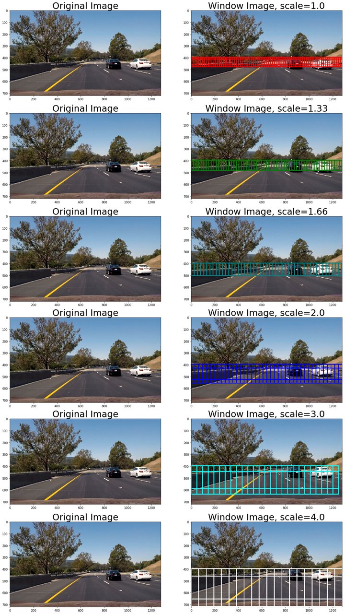
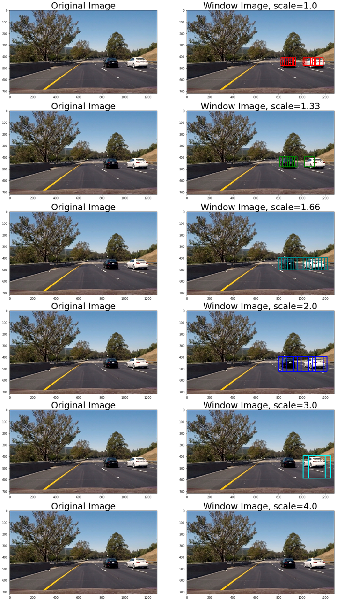
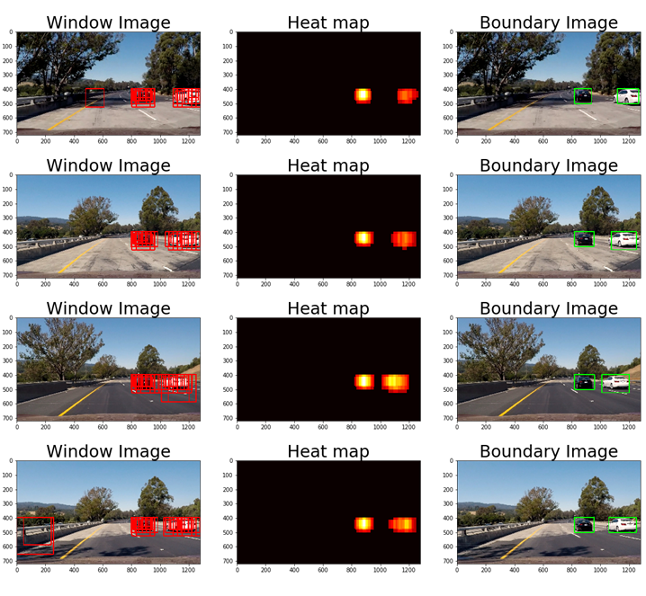

# Vehicle Detection Project

The goals / steps of this project are the following:

* Perform a Histogram of Oriented Gradients (HOG) feature extraction on a labeled training set of images and train a classifier Linear SVM classifier
* Optionally, you can also apply a color transform and append binned color features, as well as histograms of color, to your HOG feature vector.
* Note: for those first two steps don't forget to normalize your features and randomize a selection for training and testing.
* Implement a sliding-window technique and use your trained classifier to search for vehicles in images.
* Run your pipeline on a video stream (start with the test_video.mp4 and later implement on full project_video.mp4) and create a heat map of recurring detections frame by frame to reject outliers and follow detected vehicles.
* Estimate a bounding box for vehicles detected.

## [Rubric](https://review.udacity.com/#!/rubrics/513/view) Points
### Here I will consider the rubric points individually and describe how I addressed each point in my implementation.  

---
### Histogram of Oriented Gradients (HOG)

#### 1. Explain how (and identify where in your code) you extracted HOG features from the training images.

The code for this step is contained in a function called `extract_features()` at the 2nd code cell (In [2]:) of `P5.ipynb`.  

I started by reading in all the `cars` and `notcars` images.  Here is an example of one of each of the `cars` and `notcars` classes at the 3rd code cell (In [3]:) of `P5.ipynb`:

 
 
A car and a Not-car  

I then explored each color channel, Y, U, V respectively. I grabbed random images from the car classe and displayed them to get a feel for what the `skimage.hog()` output looks like.

Here is an example using the `YUV` color space and HOG parameters of `orientations=12`, `pixels_per_cell=(16, 16)` and `cells_per_block=(2, 2)`:

 
 
HOG features with YUV color channel  

#### 2. Explain how you settled on your final choice of HOG parameters.

I decided the color space and these parameters reffering to [this GitHub repository](https://github.com/jeremy-shannon/CarND-Vehicle-Detection). However I changed the `orientations` from `11` to `12` in order to make it straightforward to devide from 360 [degree].

#### 3. Describe how (and identify where in your code) you trained a classifier using your selected HOG features and color features if you used them.

Before training, I added two color features, Spatial Binning and Color Histograms, to HOG features.

 
 
Spatial Binning 

 
 
Color Histograms  

Then I normalized the concatenated features and trained a linear SVM with `C=1` (default) using color and HOG features at the 4th code cell (In [4]:) of `P5.ipynb`.

 
 
Normalized Features  

The test accuray of the SVC was `0.9947`, which is pretty high.

### Sliding Window Search

#### 1. Describe how (and identify where in your code) you implemented a sliding window search.  How did you decide what scales to search and how much to overlap windows?

I decided to search multiple scale windows under 400 [pixel] to detect both near and far cars using a function named `find_cars()` at the 5th code cell (In [5]:) of `P5.ipynb`.

 
 
Multiple Scale Windows  

After playing with parameters, I found out that small cars near the horizontal line of the picture, which mean the cars are far from own vehicle, were hard to be detected. So I added the value `1.33`(green window) and `1.66`(dark blue window) into the `scales` array.

#### 2. Show some examples of test images to demonstrate how your pipeline is working.

The detected result is like below. The bigger `scale` becomes, the less detected windows are, which is proper trend.

 
 
Sliding Window Search  

---

### Video Implementation

#### 1. Provide a link to your final video output.  Your pipeline should perform reasonably well on the entire project video (somewhat wobbly or unstable bounding boxes are ok as long as you are identifying the vehicles most of the time with minimal false positives.)

Here's a [link to my video result](./output_videos/project_video_output.mp4)

#### 2. Describe how (and identify where in your code) you implemented some kind of filter for false positives and some method for combining overlapping bounding boxes.

To get rid of false detection, the program would create a `heatmap` based on the number of detected windows and apply a `threshold` at the 9th code cell (In [18]:) of `P5.ipynb`. Then the program would draw boundary boxes using `scipy.ndimage.measurements.label()` with the `heatmap`. The result of this section is like this:

 
 
Create a heatmap and apply a thereshold  

To take advantages of video and make more robust detection, I created a class object called `Cars()` at the 10th code cell (In [19]:) of `P5.ipynb` and stored an average heatmap over the last 15 [frame] of the video. I also overwrote the function named `createHeatmap()` to use the average heatmap stored in the `Cars()` class at the 11th code cell (In [20]:) of `P5.ipynb`. By using these new features for video pipline and tuning several parameters, the program detected cars smoothly and removed more false detections.

---

### Discussion

#### 1. Briefly discuss any problems / issues you faced in your implementation of this project.  Where will your pipeline likely fail?  What could you do to make it more robust?

The program took average of the `heatmap` after sliding windows, so if cars drove too fast, the value of the `heatmap` would be less than the `threshold` and the program wouldn't detect the fast cars (the program would recognize these cars as false detection). It depends on the value of `threshold` and the number of flames to take average, and these parameters need to be hyper tuned to behave properly in all possible cases. 
